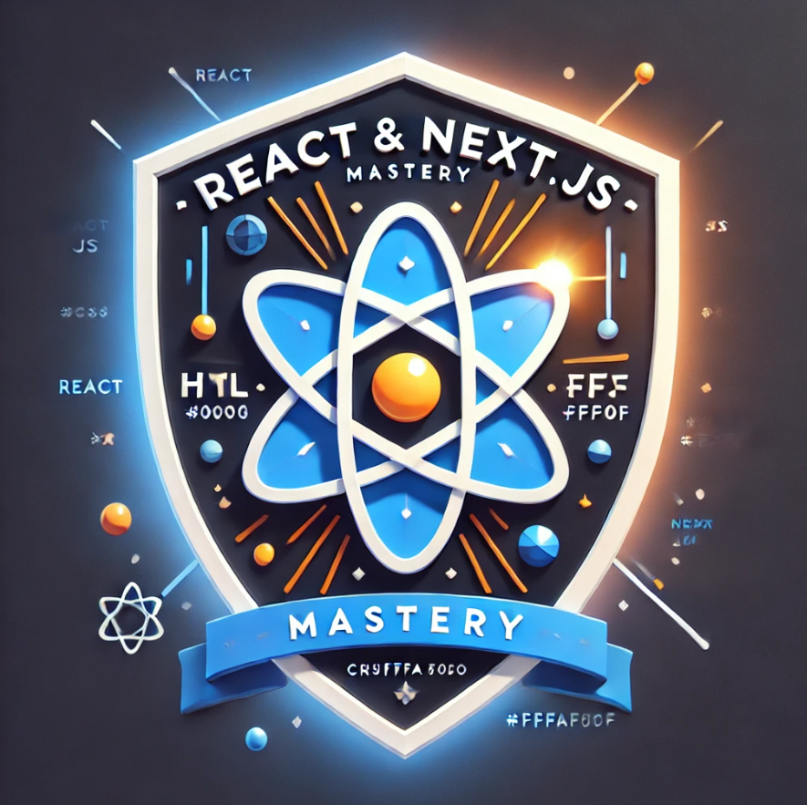

# DevQuest - La Aventura del Desarrollo en React y Next.js 🚀

¡Bienvenido aventurero al curso más emocionante de React y Next.js! Prepárate para una aventura épica donde no solo dominarás React, sino que también descubrirás los poderes legendarios de Next.js.

<p align="center">
  
</p>

<div align="center">


</div>

## 📜 Sobre esta Aventura

DevQuest es un curso completo estructurado como un juego de rol donde cada nuevo concepto es una misión por completar y cada proyecto una batalla por ganar. Comenzarás dominando las artes de React y luego ascenderás al siguiente nivel con los poderes de Next.js.

## 🗺️ Navegación Rápida

- [📚 Documentación](#documentación)
- [🎯 Objetivos del Curso](#objetivos-del-curso)
- [🎮 Cómo Empezar](#cómo-empezar)
- [📈 Progresión](#progresión)
- [🤝 Contribuir](#contribuir)
- [📝 Licencia](#licencia)

## 📚 Documentación

Toda la documentación está disponible en la carpeta [/docs](/docs):
- [Guía de inicio](/docs/getting-started.md)
- [Estructura del curso](/docs/course-structure.md)
- [Guía de contribución](/CONTRIBUTING.md)

## 🎯 Objetivos del Curso

Al completar esta aventura, habrás:
- Dominado los fundamentos y conceptos avanzados de React
- Desbloqueado los poderes legendarios de Next.js
- Construido aplicaciones full-stack escalables
- Aprendido las mejores prácticas de la industria
- Desbloqueado habilidades técnicas esenciales
- Formado parte de una comunidad de desarrolladores

[Ver detalles completos del programa](/docs/course-objectives.md)

## 🗺️ Mapa del Camino del Héroe

### Capítulo 1: El Despertar del Desarrollador
[Ver contenido del Capítulo 1](/docs/chapters/chapter-1/)
- Fundamentos de JavaScript Moderno (ES6+)
- El poder del Virtual DOM
- JSX: El lenguaje de los hechiceros
- Componentes: Las armas básicas

[Ver todos los capítulos...](/docs/chapters/)

## 🎮 Cómo Empezar

1. Clona este repositorio:
```bash
git clone https://github.com/tuuser/devquest-course.git
cd devquest-course
```

2. Instala las dependencias del proyecto base:
```bash
cd projects/basic-quest
npm install
```

3. Sigue la [guía de inicio](/docs/getting-started.md)

## 📈 Progresión

El curso está diseñado para una progresión natural:

1. **Novato (Capítulos 1-2)**
   - Fundamentos de React
   - Primeros pasos con Next.js

2. **Aventurero (Capítulos 3-4)**
   - Server Components básicos
   - Routing con App Router

[Ver sistema completo de progresión](/docs/progression-system.md)

## 📁 Estructura del Reino (Repositorio)

```
devquest/
├── README.md                # El pergamino principal (documentación principal)
├── CONTRIBUTING.md         # Guía para nuevos aventureros (contribuidores)
├── LICENSE                 # Términos del reino (licencia)
│
├── docs/                   # 📚 Grimorios (Documentación)
│   ├── getting-started.md  # Guía del primer día
│   ├── chapters/          # Capítulos del viaje
│   │   ├── chapter-1/     # El Despertar del Desarrollador
│   │   │   ├── README.md  # Descripción del capítulo
│   │   │   ├── lessons/   # Lecciones individuales
│   │   │   └── assets/    # Recursos del capítulo
│   │   └── ...            # Más capítulos
│   └── assets/            # Recursos generales
│
├── exercises/             # ⚔️ Campo de Entrenamiento (Ejercicios)
│   ├── chapter-1/        # Ejercicios del primer capítulo
│   │   ├── README.md     # Instrucciones
│   │   ├── exercise-1/   # Primer ejercicio
│   │   └── exercise-2/   # Segundo ejercicio
│   └── ...               # Más ejercicios
│
├── projects/             # 🏰 Misiones Principales (Proyectos)
│   ├── basic-quest/     # Proyecto React básico
│   │   ├── README.md    # Instrucciones del proyecto
│   │   └── src/         # Código fuente
│   ├── advanced-quest/  # Proyecto React avanzado
│   └── legendary-quest/ # Proyecto final Next.js
│
└── resources/           # 🎮 Arsenal del Héroe (Recursos)
    ├── cheatsheets/    # Pergaminos de referencia rápida
    ├── templates/      # Templates para misiones
    └── solutions/      # Grimorios de soluciones (en rama separada)
```

## 🛠️ Requisitos Previos

- Node.js 18.17 o superior
- Conocimientos básicos de JavaScript
- Editor de código (recomendado: VS Code)
- Git instalado

## 🤝 Contribuir

¡Tus contribuciones son bienvenidas! Por favor lee nuestra [guía de contribución](/CONTRIBUTING.md) antes de empezar.

## 💖 Agradecimientos

Un agradecimiento especial a todos los héroes que han contribuido a este proyecto:

<a href="https://github.com/borchsolutions/devquest/graphs/contributors">
  
</a>

## 📝 Licencia

Este proyecto está bajo la licencia MIT. Ver el archivo [LICENSE](/LICENSE) para más detalles.

---

<div align="center">

**¿Listo para comenzar tu aventura? ¡Los reinos de React y Next.js te esperan!**

[Comenzar Aventura](/docs/getting-started.md) • [Unirse al Discord](https://discord.gg/tuenlace) • [Contribuir](/CONTRIBUTING.md)

</div>
